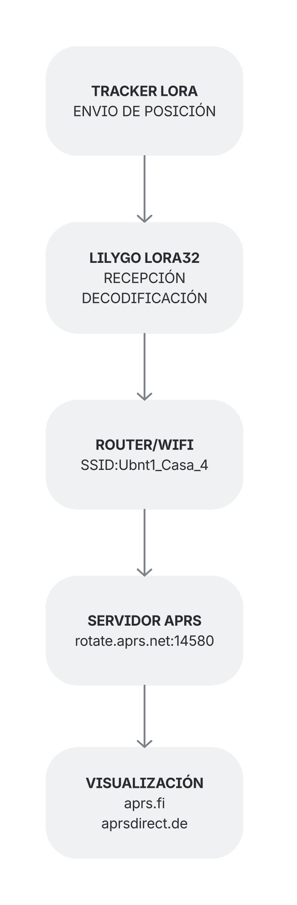

# Proyecto iGate LoRa32 con APRS-IS y OLED

Este proyecto implementa un **iGate APRS** utilizando la placa **LilyGO LoRa32 v1.6.1 (ESP32 + LoRa SX1276)**.  
El dispositivo recibe tramas APRS vía LoRa y las reenvía a **APRS-IS**, además de mostrar en una **pantalla OLED SSD1306** información en tiempo real sobre la conexión, servidor, red WiFi y paquetes RX/TX.

# Infograma


# Descripción de componentes

## LILYGO LORA32 T3 v1.6.1

Es una placa basada en ESP32 con radio LoRa integrado (habitualmente un transceptor SX127x), circuito de gestión de batería y pines para periféricos. Ejecuta el firmware que gestiona LoRa, Wi-Fi/Bluetooth y periféricos.
Interfaces típicas: SPI (para el transceptor LoRa), I²C (para OLED), UART (puerto serie hacia USB), pines digitales para señales DIO del transceptor.

## Antena LORA

Función: radiar/recibir señales RF en la frecuencia LoRa seleccionada. Es crítica para alcance y calidad del enlace.
Consejos de antena: usar el conector/antena adecuada, respetar la impedancia $50\Omega$, colocarla lejos de grandes masas metálicas y confirmar la frecuencia legal en tu país.

## Pantalla OLED

Uso habitual: mostrar información en tiempo real (RSSI, SNR, contador de paquetes RX/TX, estado de conexión Wi-Fi, nivel de batería, mensajes recientes), tiene una interfaz que es típicamente I²C (SDA/SCL) o SPI; módulos comunes usan controladores como SSD1306 es útil ya que permite monitoreo local sin necesidad de PC.

## BATERÍA LP103454 3.7V 2000mAh

Es una celda Li-ion/LiPo nominal 3.7 V, capacidad 2000 mAh cuya función es la fuente principal de energía para operación autónoma.

# Flujo de datos

- Recepción LoRa: la antena capta la señal → transceptor LoRa la entrega al ESP32 → firmware valida/decodifica paquete.
- Procesado: ESP32 interpreta el payload (por ejemplo, un mensaje APRS), actualiza contadores y estado.
- Visualización: la placa envía datos al OLED para mostrar recepción, RSSI, etc.
- Reenvío / logging: si hay PC conectado por USB, la placa puede enviar por UART los datos para que el PC los almacene o los reenvíe a un servidor. Alternativamente, el ESP32 puede usar Wi-Fi para subir datos directamente a Internet.
- Energía: batería alimenta la placa; si hay USB conectado, la placa puede estar alimentada por USB y —si la placa tiene cargador— la batería se está cargando simultáneamente.

# Diagrama de bloques



# Arquitectura del Sistema

## Componentes Principales

- Microcontrolador: ESP32 con módulo LoRa

- Comunicación inalámbrica: WiFi + LoRa

- Visualización: Pantalla OLED SSD1306

- Protocolo: APRS-IS para internet, AX.25 sobre LoRa

# Estructura del Código

## 1. Configuración de Hardware

```cpp
// LED de estado
#define LED_PIN 25

// Pantalla OLED (128x64 píxeles)
#define SCREEN_WIDTH 128
#define SCREEN_HEIGHT 64
#define OLED_ADDR 0x3C

// Pines LoRa
#define LORA_SCK     5
#define LORA_MISO    19
#define LORA_MOSI    27
#define LORA_CS      18
#define LORA_RST     14
#define LORA_IRQ     26
#define LORA_BAND    433.775E6
```

## 2. Configuración APRS
- Callsign: Identificador único en red APRS

- Servidor: rotate.aprs2.net (puerto 14580)

- Filtro geográfico: Solo paquetes dentro de 200km de la posición

## 3. Flujo de Operación
Inicialización (Setup)
- Inicia comunicación serial (115200 baudios)

- Configura GPIO y LED de estado

- Inicializa pantalla OLED mediante I2C

- Conecta a WiFi con reconexión automática

- Configura módulo LoRa (433.775 MHz, SF7, BW125kHz)

- Conecta a APRS-IS y autentica

- Envía beacon inicial de posición

## Bucle Principal (Loop)
- Escucha paquetes LoRa entrantes

- Verifica conexiones (WiFi + APRS-IS)

- Procesa tráfico APRS-IS desde internet

- Envía beacons periódicos cada 3 minutos

- Actualiza pantalla OLED cada segundo

# Funciones Clave
## Gestión de Conexiones
- connectToWiFi(): Maneja conexión/reconexión WiFi

- connectToAPRSIS(): Establece conexión con servidor APRS

- checkAPRSISConnectionHealth(): Monitorea estado de conexión

## Procesamiento de Datos
- processLoRaPacket(): Decodifica paquetes LoRa (texto/hexadecimal)

- processAPRSTraffic(): Maneja datos entrantes de APRS-IS

- sendBeacon(): Construye y envía paquete de posición

## Interface de Usuario
- updateOLEDStatus(): Muestra estado en tiempo real en pantalla

- getTimestamp(): Genera timestamps para logging

# Características de Robustez
## Reconexión Automática
- WiFi: Verificación cada 10 segundos, reconexión cada 30s

- APRS-IS: Detección de timeout (2 minutos sin tráfico)

- Ping periódico al servidor cada 60 segundos

## Monitoreo de Estado
- LED indicador: Parpadeo durante conexión, estado sólido cuando conectado

- Logging detallado: Timestamps y códigos de error

- Estadísticas: Contadores de paquetes enviados/recibidos

## Estructura de Datos
- Posición: Grados, minutos y dirección

- Comentario: Identificación de estación

- Timestamp: Tiempo de envío automático

## Dependencias y Bibliotecas
- WiFi.h: Gestión de conexión WiFi

- LoRa.h: Comunicación con módulo LoRa

- Adafruit_SSD1306.h: Control de pantalla OLED

- SPI.h: Comunicación con módulo LoRa

- Wire.h: Comunicación I2C con OLED

## Parámetros Configurables
### Intervalos de Tiempo
- Beacon: 3 minutos (180,000 ms)

- Verificación WiFi: 10 segundos

- Timeout APRS: 2 minutos

- Ping servidor: 1 minuto

### Configuración Radio
- Frecuencia: 433.775 MHz

- Spreading Factor: 7

- Ancho de Banda: 125 kHz

- Tasa de Codificación: 4/5

## Estados del Sistema
- OPERATIVO: WiFi + APRS-IS conectados

- WIFI-SOLO: Solo WiFi conectado

- OFFLINE: Sin conexiones activas
